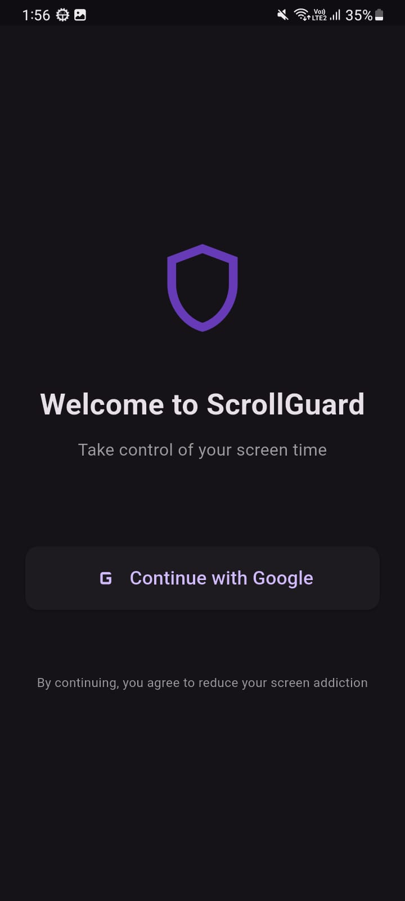
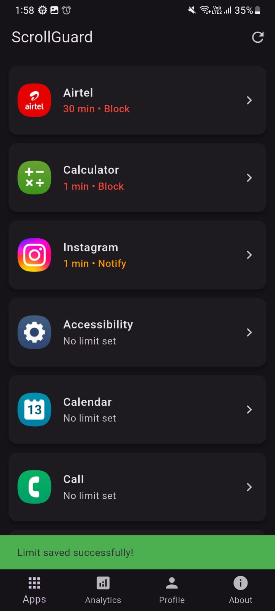
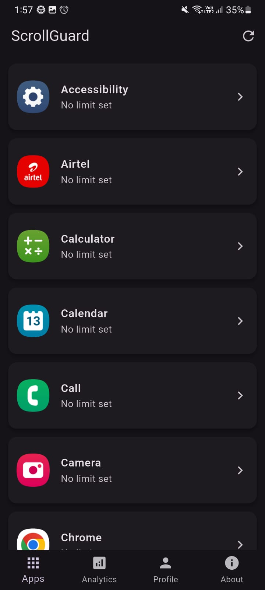
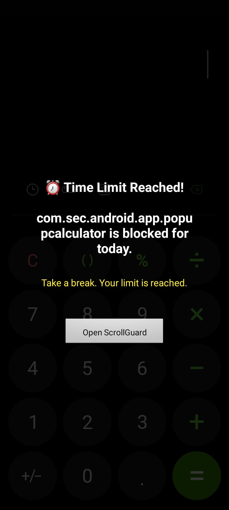
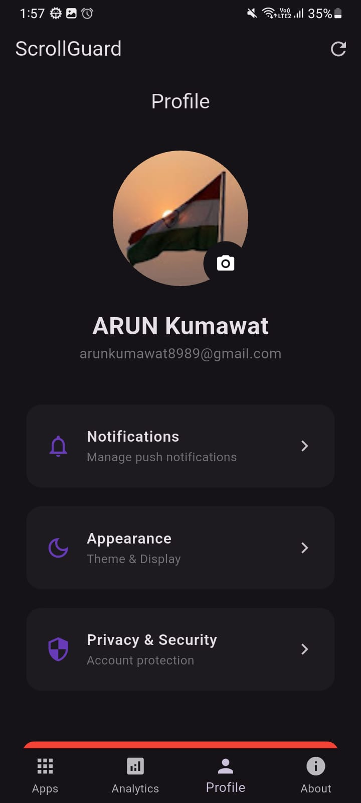
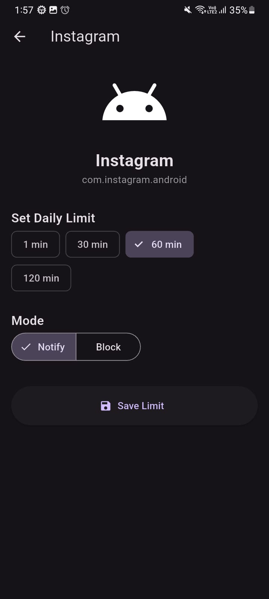
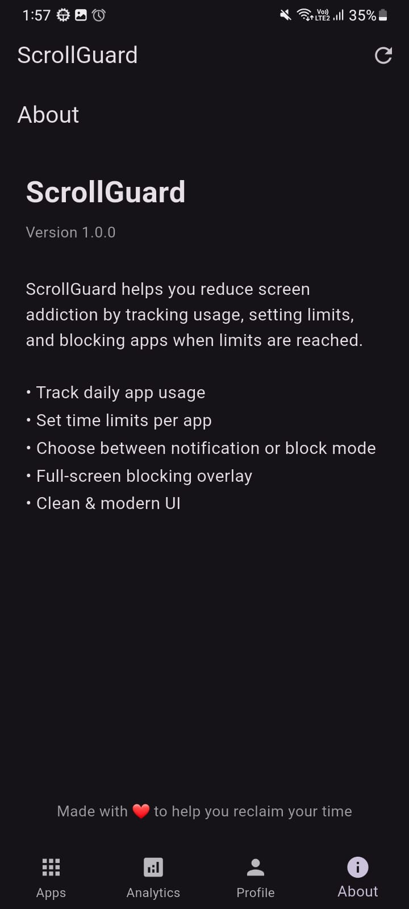

# ScrollGuard

### Digital wellbeing and app usage control for Android

ScrollGuard is an Android digital wellbeing application built with **Flutter** and **Kotlin** that helps users reduce compulsive app usage by tracking screen time, setting app-specific daily limits, and enforcing restrictions when limits are exceeded.

The app combines Flutter’s cross-platform UI capabilities with native Android system services to provide accurate usage tracking and app blocking.

---

## Project Status

**Currently in active development**

### Implemented

* Google Sign-In with Firebase Authentication
* Installed app detection with icons
* Per-app daily usage limits
* Usage tracking using Accessibility Service
* Notification-based limit alerts
* Full-screen blocking overlay
* Local storage using Hive
* Flutter ↔ Kotlin MethodChannel communication
* Permission handling flow

### Planned

* Weekly analytics dashboard
* Productivity insights and streak tracking
* Improved cloud sync
* Enhanced reporting system

---

## Features

* App usage monitoring in real time
* Daily screen-time limits for individual apps
* Two enforcement modes:

  * **Notify Mode** → Sends a warning notification
  * **Block Mode** → Prevents interaction after limit is reached
* Offline-first architecture
* Firebase profile sync
* Material 3 UI
* Profile and settings management

---

## Screenshots

### Splash


### Login



### Home



### App List



### Overlay Block



### Profile



### Set Limit



### About Screen



---

## Tech Stack

| Layer            | Technology                |
| ---------------- | ------------------------- |
| Frontend         | Flutter (Dart)            |
| State Management | Riverpod                  |
| Local Database   | Hive                      |
| Backend          | Firebase Auth + Firestore |
| Native Android   | Kotlin                    |
| Architecture     | Clean Architecture + MVVM |
| Charts           | fl_chart                  |

---

## Project Structure

```bash
lib/
 ├── core/
 ├── data/
 ├── presentation/
 └── main.dart

android/app/src/main/kotlin/com/example/scrollguard/
 ├── ScrollGuardAccessibilityService.kt
 ├── LimitManager.kt
 ├── BlockingOverlayActivity.kt
 ├── MethodChannelHandler.kt
 └── ScrollGuardService.kt
```

---

## How It Works

### Usage Tracking

A native Accessibility Service detects foreground app activity and tracks session duration.

### Limit Enforcement

When usage exceeds the configured limit:

* Notify Mode triggers a local notification
* Block Mode launches a blocking overlay activity

### Flutter-Native Bridge

Flutter communicates with Android services using MethodChannels.

### Permissions

ScrollGuard requests:

* Usage Access
* Accessibility Service
* Overlay Permission
* Notification Permission

---

## Installation

### Prerequisites

* Flutter SDK 3.8+
* Android Studio
* Firebase project setup

### Clone repository

```bash
git clone https://github.com/arunkumawatak/ScrollGuard.git
cd ScrollGuard
```

### Install packages

```bash
flutter pub get
```

### Add Firebase config

Place:

```bash
android/app/google-services.json
```

### Run app

```bash
flutter run
```

---

## What I Learned

This project helped me gain hands-on experience with:

* Native Android accessibility services
* Foreground services and overlays
* Flutter ↔ Kotlin integration using MethodChannels
* Managing Android special permissions
* State management using Riverpod
* Clean architecture implementation
* Firebase authentication and cloud sync

---

## License

MIT License

---

## Developer

**Arun Kumawat**

Flutter Developer focused on building production-ready mobile applications with Flutter and native Android integration.

GitHub: [https://github.com/arunkumawatak](https://github.com/arunkumawatak)

---

If you find this project useful, consider starring the repository.
